# 📋 Expense Management System - Complete Project Documentation

## Table of Contents
1. [Project Overview](#project-overview)
2. [System Architecture](#system-architecture)
3. [Use Case Diagrams](#use-case-diagrams)
4. [Flow Charts](#flow-charts)
5. [Database Design](#database-design)
6. [Technology Stack](#technology-stack)
7. [Feature Analysis](#feature-analysis)
8. [Security Implementation](#security-implementation)
9. [API Documentation](#api-documentation)
10. [Deployment Guide](#deployment-guide)

---

## 1. Project Overview

### 1.1 Project Description
The Expense Management System is a comprehensive web-based application designed to streamline expense reporting, approval workflows, and financial management for organizations of all sizes. Built with modern web technologies, it provides a scalable, secure, and user-friendly platform for managing business expenses.

### 1.2 Project Objectives
- **Automate Expense Reporting**: Eliminate manual paper-based expense reporting
- **Streamline Approval Process**: Implement configurable multi-level approval workflows
- **Enhance Financial Control**: Provide real-time visibility into organizational spending
- **Improve User Experience**: Offer intuitive interfaces for all user roles
- **Ensure Compliance**: Maintain audit trails and enforce company policies

### 1.3 Target Users
- **Employees**: Submit and track expense reports
- **Managers**: Review and approve team expenses
- **Administrators**: Manage system configuration and users
- **Finance Teams**: Monitor spending and generate reports

---

## 2. System Architecture

### 2.1 High-Level Architecture

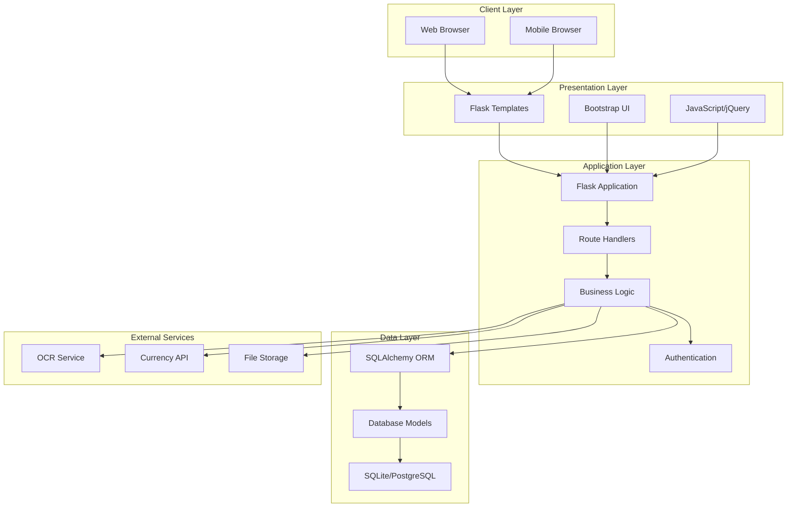

### 2.2 Component Architecture

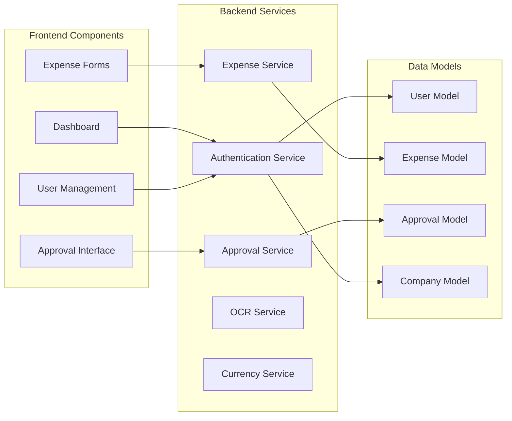

---

## 3. Use Case Diagrams

### 3.1 Employee Use Cases

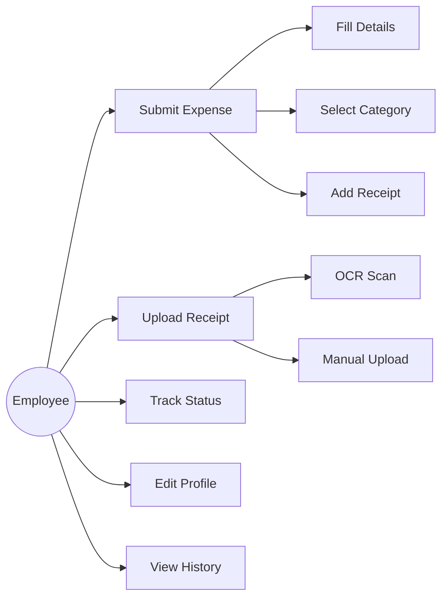

### 3.2 Manager Use Cases

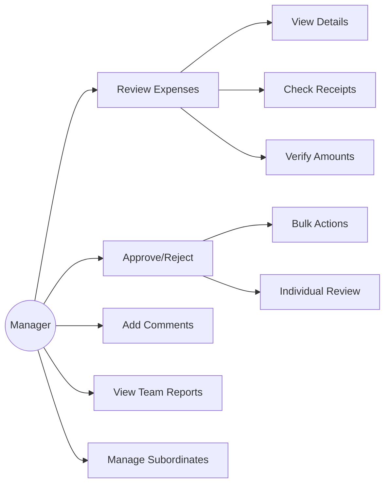

### 3.3 Admin Use Cases

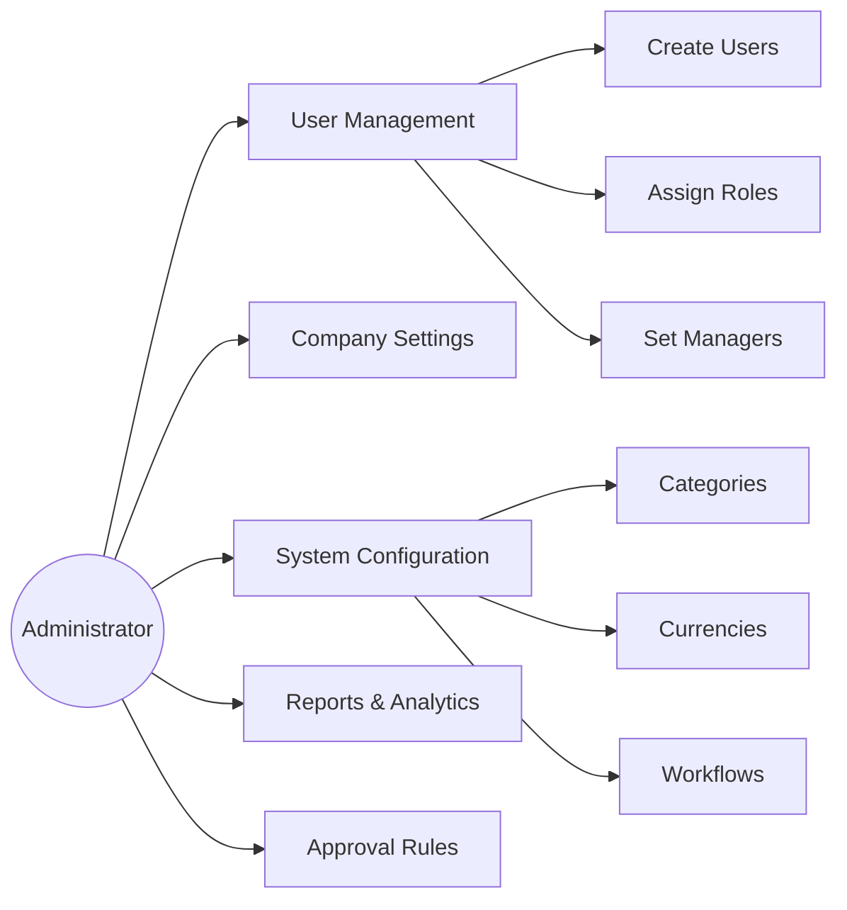

---

## 4. Flow Charts

### 4.1 Expense Submission Flow

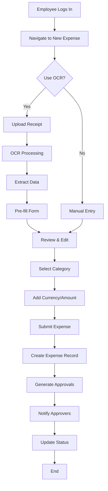

### 4.2 Approval Workflow

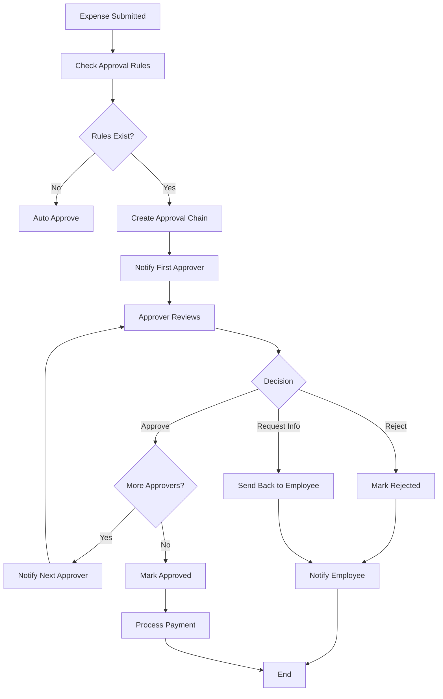

### 4.3 User Authentication Flow

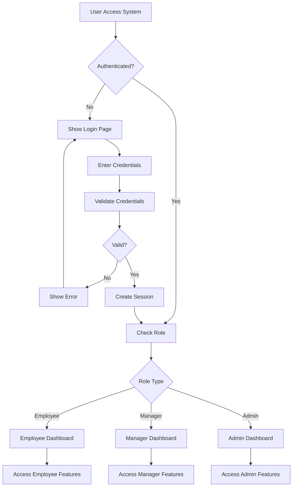

### 4.4 OCR Processing Flow

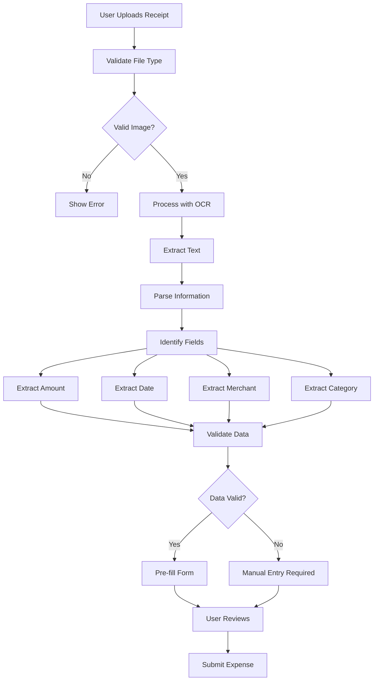

---

## 5. Database Design

### 5.1 Entity Relationship Diagram

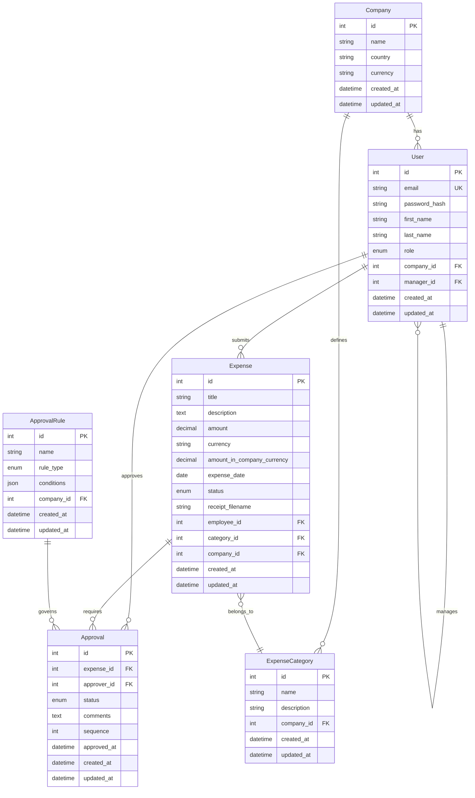

### 5.2 Database Schema Details

#### 5.2.1 Core Tables
- **Company**: Stores organization information and settings
- **User**: Manages user accounts with role-based access
- **Expense**: Central table for expense records
- **Approval**: Tracks approval workflow steps
- **ExpenseCategory**: Categorizes expenses for reporting
- **ApprovalRule**: Defines approval workflow rules

#### 5.2.2 Key Relationships
- **One-to-Many**: Company → Users, Users → Expenses
- **Many-to-One**: Expenses → Categories, Approvals → Users
- **Self-Referencing**: Users → Manager (hierarchical structure)

---

## 6. Technology Stack

### 6.1 Backend Technologies

| Technology | Version | Purpose |
|------------|---------|---------|
| **Python** | 3.8+ | Core programming language |
| **Flask** | 2.0+ | Web framework |
| **SQLAlchemy** | 1.4+ | ORM and database abstraction |
| **Flask-Login** | 0.6+ | User session management |
| **Flask-WTF** | 1.0+ | Form handling and CSRF protection |
| **Werkzeug** | 2.0+ | Password hashing and utilities |
| **Pillow** | 8.0+ | Image processing |
| **Requests** | 2.25+ | HTTP client for external APIs |

### 6.2 Frontend Technologies

| Technology | Version | Purpose |
|------------|---------|---------|
| **HTML5** | - | Markup language |
| **CSS3** | - | Styling and layout |
| **Bootstrap** | 5.0+ | UI framework and responsive design |
| **JavaScript** | ES6+ | Client-side scripting |
| **jQuery** | 3.6+ | DOM manipulation and AJAX |
| **Font Awesome** | 6.0+ | Icons and visual elements |

### 6.3 Database Options

| Database | Use Case | Benefits |
|----------|----------|----------|
| **SQLite** | Development/Small deployments | Zero configuration, file-based |
| **PostgreSQL** | Production/Large scale | ACID compliance, advanced features |
| **MySQL** | Production/Medium scale | Wide support, good performance |

### 6.4 External Services

| Service | Purpose | Integration |
|---------|---------|-------------|
| **Tesseract OCR** | Receipt text extraction | Python wrapper |
| **Exchange Rate API** | Currency conversion | REST API |
| **REST Countries API** | Country/currency data | REST API |

---

## 7. Feature Analysis

### 7.1 Core Features Matrix

| Feature | Employee | Manager | Admin | Implementation Status |
|---------|----------|---------|-------|----------------------|
| Submit Expenses | ✅ | ✅ | ✅ | Complete |
| OCR Scanning | ✅ | ✅ | ✅ | Complete |
| View Own Expenses | ✅ | ✅ | ✅ | Complete |
| Approve Expenses | ❌ | ✅ | ✅ | Complete |
| User Management | ❌ | ❌ | ✅ | Complete |
| Company Settings | ❌ | ❌ | ✅ | Complete |
| Bulk Actions | ❌ | ✅ | ✅ | Complete |
| Advanced Reports | ❌ | ✅ | ✅ | Planned |

### 7.2 Feature Complexity Analysis

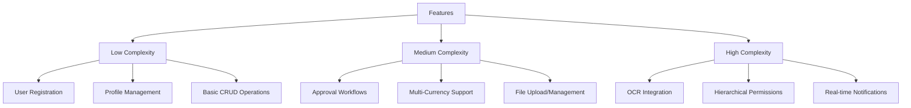

---

## 8. Security Implementation

### 8.1 Security Layers

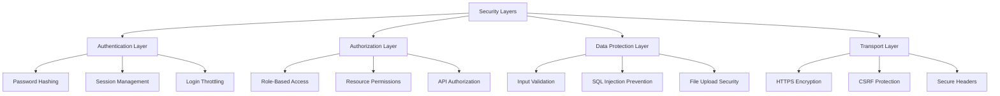

### 8.2 Security Measures

| Security Aspect | Implementation | Technology |
|------------------|----------------|------------|
| **Password Security** | bcrypt hashing with salt | Werkzeug |
| **Session Management** | Secure cookie-based sessions | Flask-Login |
| **CSRF Protection** | Token-based validation | Flask-WTF |
| **Input Validation** | Server-side validation | WTForms |
| **File Upload Security** | Type validation, size limits | Custom validators |
| **SQL Injection Prevention** | ORM parameterized queries | SQLAlchemy |

---

## 9. API Documentation

### 9.1 Authentication Endpoints

| Method | Endpoint | Description | Parameters |
|--------|----------|-------------|------------|
| POST | `/register` | User registration | email, password, company_info |
| POST | `/login` | User authentication | email, password |
| GET | `/logout` | User logout | - |

### 9.2 Expense Management Endpoints

| Method | Endpoint | Description | Parameters |
|--------|----------|-------------|------------|
| GET | `/expenses` | List user expenses | page, per_page |
| POST | `/expenses/new` | Create new expense | expense_data, receipt_file |
| GET | `/api/expenses/<id>` | Get expense details | expense_id |
| PUT | `/api/expenses/<id>` | Update expense | expense_id, expense_data |

### 9.3 Approval Endpoints

| Method | Endpoint | Description | Parameters |
|--------|----------|-------------|------------|
| GET | `/approvals` | List pending approvals | page, per_page |
| POST | `/approvals/<id>/approve` | Approve expense | approval_id, comments |
| POST | `/approvals/<id>/reject` | Reject expense | approval_id, comments |

### 9.4 Utility Endpoints

| Method | Endpoint | Description | Parameters |
|--------|----------|-------------|------------|
| POST | `/api/ocr/process` | Process receipt OCR | image_file |
| GET | `/api/countries` | Get countries/currencies | - |
| GET | `/api/exchange-rate/<from>/<to>` | Get exchange rate | from_currency, to_currency |

---

## 10. Deployment Guide

### 10.1 Development Deployment

```bash
# Clone repository
git clone <repository-url>
cd expense-management

# Setup virtual environment
python -m venv venv
source venv/bin/activate  # Windows: venv\Scripts\activate

# Install dependencies
pip install -r requirements.txt

# Setup environment variables
cp .env.example .env
# Edit .env with your configuration

# Run application
python app.py
```

### 10.2 Production Deployment Architecture

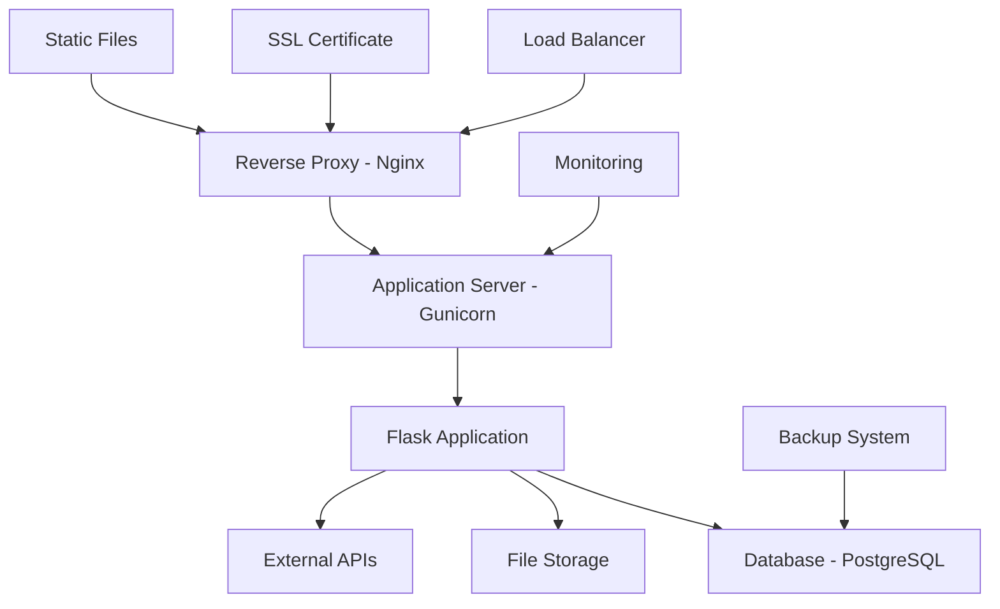

### 10.3 Docker Deployment

```dockerfile
# Dockerfile
FROM python:3.9-slim

WORKDIR /app

COPY requirements.txt .
RUN pip install --no-cache-dir -r requirements.txt

COPY . .

EXPOSE 5000

CMD ["gunicorn", "--bind", "0.0.0.0:5000", "--workers", "4", "app:app"]
```

### 10.4 Environment Configuration

| Environment | Database | Web Server | Caching | Monitoring |
|-------------|----------|------------|---------|------------|
| **Development** | SQLite | Flask Dev Server | None | Console Logs |
| **Staging** | PostgreSQL | Gunicorn | Redis | Basic Logging |
| **Production** | PostgreSQL | Gunicorn + Nginx | Redis | Full Monitoring |

---

## 11. Performance Considerations

### 11.1 Database Optimization
- **Indexing**: Strategic indexes on frequently queried columns
- **Query Optimization**: Efficient SQLAlchemy queries with joins
- **Connection Pooling**: Database connection management
- **Pagination**: Large dataset handling

### 11.2 Application Performance
- **Caching**: Redis for session and data caching
- **Static Files**: CDN for static asset delivery
- **Image Optimization**: Compressed receipt images
- **Lazy Loading**: On-demand data loading

### 11.3 Scalability Planning
- **Horizontal Scaling**: Multiple application instances
- **Database Sharding**: Company-based data partitioning
- **Microservices**: Service decomposition for large scale
- **Load Balancing**: Traffic distribution

---

## 12. Testing Strategy

### 12.1 Testing Pyramid

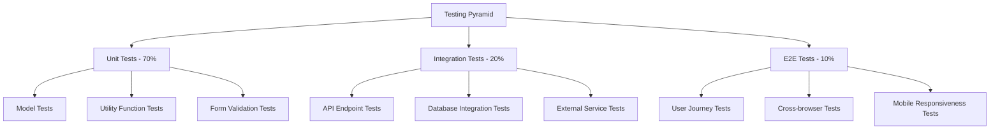

### 12.2 Test Coverage Goals
- **Unit Tests**: 90%+ code coverage
- **Integration Tests**: All API endpoints
- **End-to-End Tests**: Critical user journeys
- **Performance Tests**: Load and stress testing

---

## 13. Maintenance and Support

### 13.1 Monitoring and Logging
- **Application Logs**: Structured logging with levels
- **Error Tracking**: Exception monitoring and alerts
- **Performance Metrics**: Response times and throughput
- **User Analytics**: Usage patterns and feature adoption

### 13.2 Backup and Recovery
- **Database Backups**: Automated daily backups
- **File Backups**: Receipt and document storage
- **Disaster Recovery**: Multi-region deployment
- **Data Retention**: Configurable retention policies

### 13.3 Update and Maintenance
- **Security Updates**: Regular dependency updates
- **Feature Releases**: Planned feature rollouts
- **Bug Fixes**: Issue tracking and resolution
- **Documentation**: Continuous documentation updates

---

## 14. Future Enhancements

### 14.1 Planned Features
- **Mobile Application**: Native iOS/Android apps
- **Advanced Analytics**: Business intelligence dashboard
- **Integration APIs**: Third-party system integration
- **Machine Learning**: Smart expense categorization
- **Workflow Designer**: Visual workflow builder

### 14.2 Technology Roadmap
- **Microservices Architecture**: Service decomposition
- **GraphQL API**: Flexible data querying
- **Real-time Features**: WebSocket integration
- **Cloud Native**: Kubernetes deployment
- **AI/ML Integration**: Intelligent automation

---

## Conclusion

The Expense Management System represents a comprehensive solution for modern expense management needs. Built with scalability, security, and user experience in mind, it provides a solid foundation for organizations looking to streamline their expense management processes.

The system's modular architecture, comprehensive feature set, and robust security implementation make it suitable for deployment in various organizational contexts, from small businesses to large enterprises.

For technical support, feature requests, or contributions, please refer to the project repository and documentation.

---

*Document Version: 1.0*  
*Last Updated: October 2025*  
*Author: Development Team*
