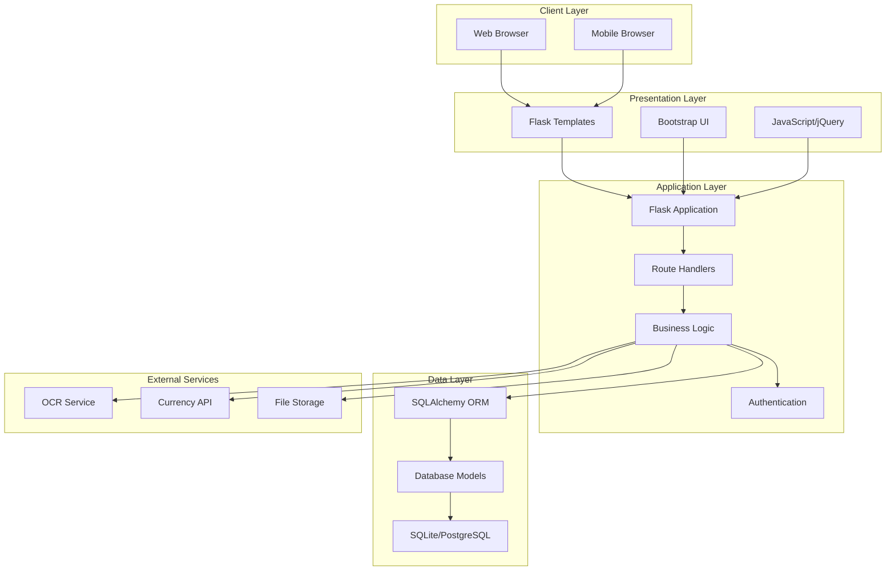
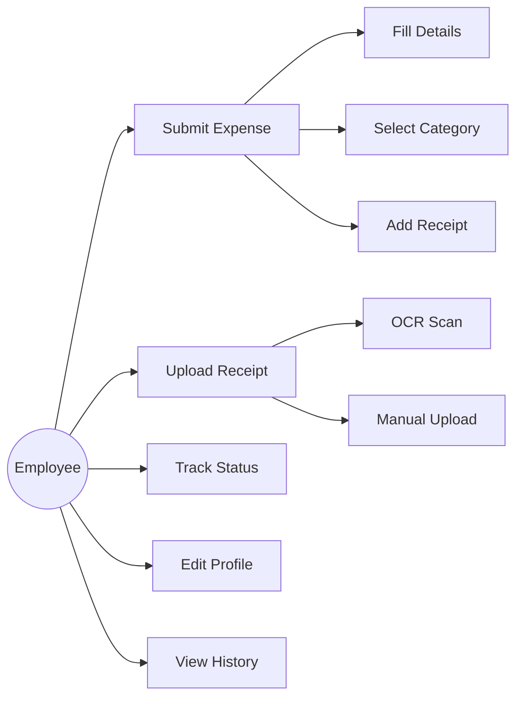
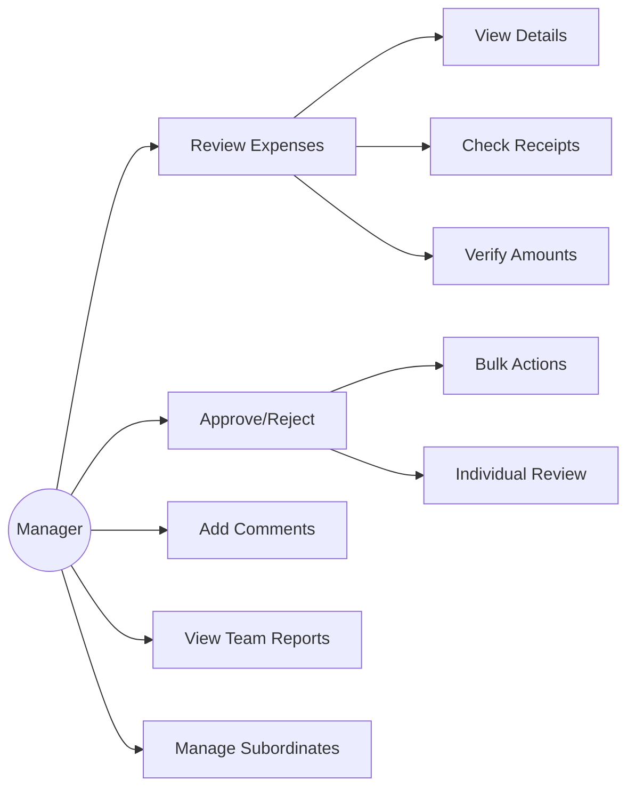
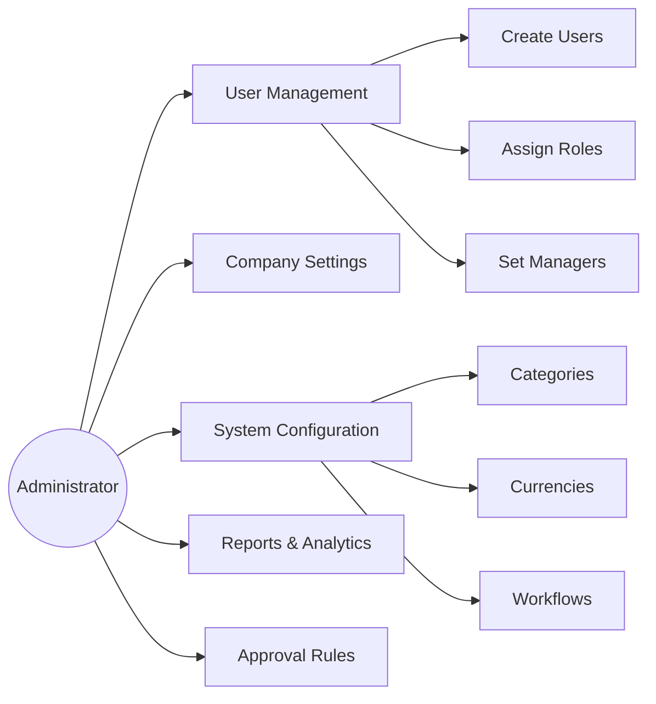
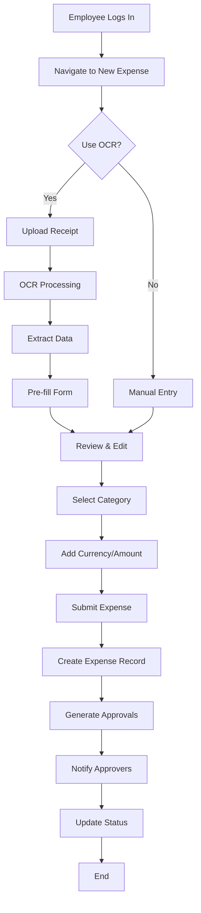
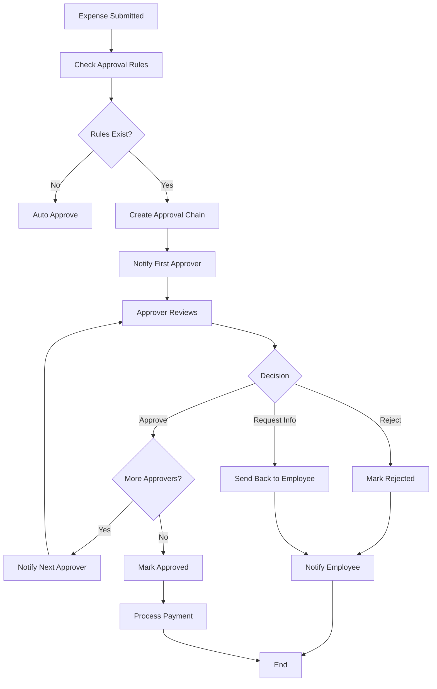
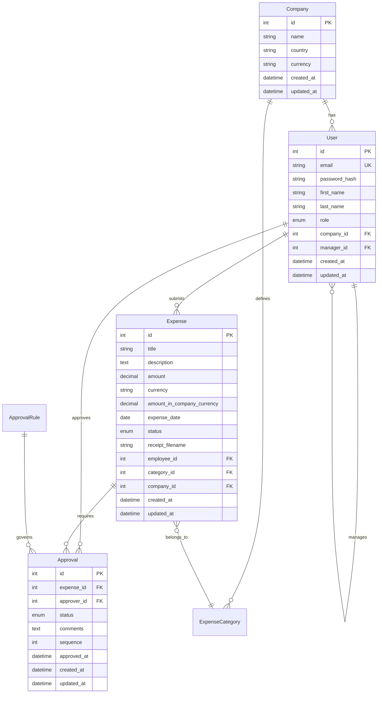

# 📋 Expense Management System - Complete Project Documentation

## Table of Contents
1. [Project Overview](#project-overview)
2. [System Architecture](#system-architecture)
3. [Use Case Diagrams](#use-case-diagrams)
4. [Flow Charts](#flow-charts)
5. [Database Design](#database-design)
6. [Technology Stack](#technology-stack)
7. [Feature Analysis](#feature-analysis)
8. [Security Implementation](#security-implementation)
9. [API Documentation](#api-documentation)
10. [Deployment Guide](#deployment-guide)

---

## 1. Project Overview

### 1.1 Project Description
The Expense Management System is a comprehensive web-based application designed to streamline expense reporting, approval workflows, and financial management for organizations of all sizes. Built with modern web technologies, it provides a scalable, secure, and user-friendly platform for managing business expenses.

### 1.2 Key Features
- **Multi-role Authentication**: Admin, Manager, Employee roles with hierarchical permissions
- **Expense Management**: Create, edit, track expenses with multi-currency support
- **Approval Workflows**: Configurable multi-level approval processes
- **OCR Integration**: Automatic receipt data extraction using Tesseract OCR
- **Real-time Analytics**: Dashboard with spending insights and statistics
- **Responsive Design**: Mobile-first UI with Bootstrap 5

---

## 2. System Architecture

### 2.1 High-Level Architecture



---

## 3. Use Case Diagrams

### 3.1 Employee Use Cases



### 3.2 Manager Use Cases



### 3.3 Admin Use Cases



---

## 4. Flow Charts

### 4.1 Expense Submission Flow



### 4.2 Approval Workflow



---

## 5. Database Design

### 5.1 Entity Relationship Diagram



---

## 6. Technology Stack

### 6.1 Backend Technologies

| Technology | Version | Purpose |
|------------|---------|---------|
| **Python** | 3.8+ | Core programming language |
| **Flask** | 2.0+ | Web framework |
| **SQLAlchemy** | 1.4+ | ORM and database abstraction |
| **Flask-Login** | 0.6+ | User session management |
| **Flask-WTF** | 1.0+ | Form handling and CSRF protection |
| **Werkzeug** | 2.0+ | Password hashing and utilities |
| **Pillow** | 8.0+ | Image processing |
| **Requests** | 2.25+ | HTTP client for external APIs |

### 6.2 Frontend Technologies

| Technology | Version | Purpose |
|------------|---------|---------|
| **HTML5** | - | Markup language |
| **CSS3** | - | Styling and layout |
| **Bootstrap** | 5.0+ | UI framework and responsive design |
| **JavaScript** | ES6+ | Client-side scripting |
| **jQuery** | 3.6+ | DOM manipulation and AJAX |
| **Font Awesome** | 6.0+ | Icons and visual elements |

---

## 7. API Documentation

### 7.1 Authentication Endpoints

| Method | Endpoint | Description | Parameters |
|--------|----------|-------------|------------|
| POST | `/register` | User registration | email, password, company_info |
| POST | `/login` | User authentication | email, password |
| GET | `/logout` | User logout | - |

### 7.2 Expense Management Endpoints

| Method | Endpoint | Description | Parameters |
|--------|----------|-------------|------------|
| GET | `/expenses` | List user expenses | page, per_page |
| POST | `/expenses/new` | Create new expense | expense_data, receipt_file |
| GET | `/api/expenses/<id>` | Get expense details | expense_id |
| PUT | `/api/expenses/<id>` | Update expense | expense_id, expense_data |

### 7.3 Approval Endpoints

| Method | Endpoint | Description | Parameters |
|--------|----------|-------------|------------|
| GET | `/approvals` | List pending approvals | page, per_page |
| POST | `/approvals/<id>/approve` | Approve expense | approval_id, comments |
| POST | `/approvals/<id>/reject` | Reject expense | approval_id, comments |

---

## 8. Security Implementation

### 8.1 Security Layers

- **Authentication**: bcrypt password hashing with salt
- **Authorization**: Role-based access control (RBAC)
- **Session Management**: Secure cookie-based sessions
- **CSRF Protection**: Token-based validation
- **Input Validation**: Server-side validation for all inputs
- **File Upload Security**: Type validation and size limits
- **SQL Injection Prevention**: Parameterized queries via ORM

---

## 9. Deployment Guide

### 9.1 Development Setup

```bash
# Clone repository
git clone <repository-url>
cd expense-management

# Setup virtual environment
python -m venv venv
source venv/bin/activate  # Windows: venv\Scripts\activate

# Install dependencies
pip install -r requirements.txt

# Setup environment variables
cp .env.example .env
# Edit .env with your configuration

# Run application
python app.py
```

### 9.2 Production Deployment

```yaml
# docker-compose.yml
version: '3.8'
services:
  web:
    build: .
    ports:
      - "5000:5000"
    environment:
      - FLASK_ENV=production
      - DATABASE_URL=postgresql://user:pass@db:5432/expense_db
    depends_on:
      - db
  
  db:
    image: postgres:13
    environment:
      - POSTGRES_DB=expense_db
      - POSTGRES_USER=user
      - POSTGRES_PASSWORD=pass
    volumes:
      - postgres_data:/var/lib/postgresql/data

volumes:
  postgres_data:
```

---

*Document Version: 1.0*  
*Last Updated: October 2025*  
*Author: Development Team*
